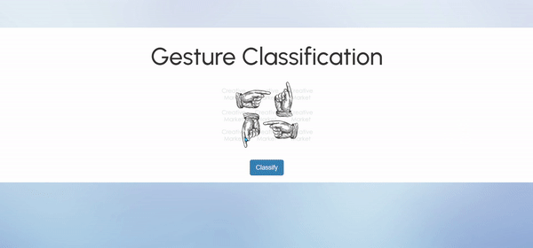

# Gesture Classification

This web app is used to classify in what direction, is the person's hand pointing to.

# Built with

# Overview

-   The model has been built on top of keras Sequential api and uses LSTM for training.

-   One thing to note is that the words in the sentence has been vectorized, so similar words may have similar vectors, which is a better option than using bag of words or Tf-Idf, which do not take into account the semantics of sentences.

-   Training a deep learning model on local system takes a lot of time, thats why the model has been trained on google collab with GPU session.

-   Finally, to make the web app Flask has been used in the Backend and HTML, CSS and Bootstrap on the frontend.

# Note

In the repo you can see Procfile, it is there because we made an attempt to deploy the app on heroku. The maximum allowed slug size on heroku is 500 Mb and tensorflow 2.3.0 is itself around 300 Mb and model.tflite is around 5.6 Mb, therefore we were unable to deploy it on heroku.

# Demo

## Future Scope

-   Deploy the web app on heroku
-   To optimize the model with better training datasets
-   Optimize Flask app.py
-   Improve Front-End

## Authors

-   [Saurav Jha](https://www.linkedin.com/in/saurav-jha-603173136/)
-   [Mitansh Khurana](https://www.linkedin.com/in/mitansh-khurana-808629a0/)
-   [Manjot Singh Saggu](https://www.linkedin.com/in/manjot-singh-622764166/)
